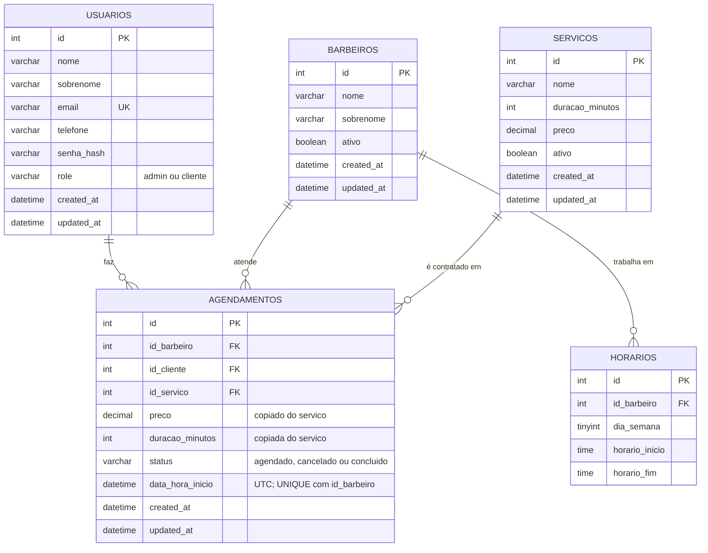

# Modelo de dados

```mermaid
erDiagram
    USUARIOS ||--o{ AGENDAMENTOS : "faz"
    BARBEIROS ||--o{ AGENDAMENTOS : "atende"
    SERVICOS ||--o{ AGENDAMENTOS : "é contratado em"
    BARBEIROS ||--o{ HORARIOS : "trabalha em"

    USUARIOS {
        int id PK
        varchar nome
        varchar sobrenome
        varchar email UK
        varchar telefone
        varchar senha_hash
        varchar role "admin ou cliente"
        datetime created_at
        datetime updated_at
    }

    BARBEIROS {
        int id PK
        varchar nome
        varchar sobrenome
        boolean ativo
        datetime created_at
        datetime updated_at
    }

    SERVICOS {
        int id PK
        varchar nome
        int duracao_minutos
        decimal preco
        boolean ativo
        datetime created_at
        datetime updated_at
    }

    HORARIOS {
        int id PK
        int id_barbeiro FK
        tinyint dia_semana
        time horario_inicio
        time horario_fim
    }

    AGENDAMENTOS {
        int id PK
        int id_barbeiro FK
        int id_cliente FK
        int id_servico FK
        decimal preco "copiado do servico"
        int duracao_minutos "copiada do servico"
        varchar status "agendado, cancelado ou concluido"
        datetime data_hora_inicio "UTC; UNIQUE com id_barbeiro"
        datetime created_at
        datetime updated_at
    }
```